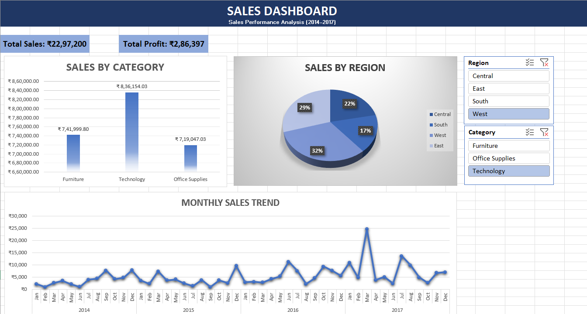

# 📊 Sales Dashboard (Excel)

## 📌 Overview
This project presents an interactive Sales Dashboard built using Microsoft Excel to analyze supermarket sales data (2014–2017).

## 🔍 Key Insights
- Total Sales: ₹22.97L+
- Total Profit: ₹2.86L+
- Technology category generated highest sales
- West region contributed the most (~32%)
- Sales showed an overall upward trend

## 🛠 Tools Used
- Microsoft Excel
- Pivot Tables
- Pivot Charts
- Slicers

## 📷 Dashboard Preview

## 🚀 Learning Outcome
This project helped me understand data cleaning, data visualization, and building interactive dashboards.
